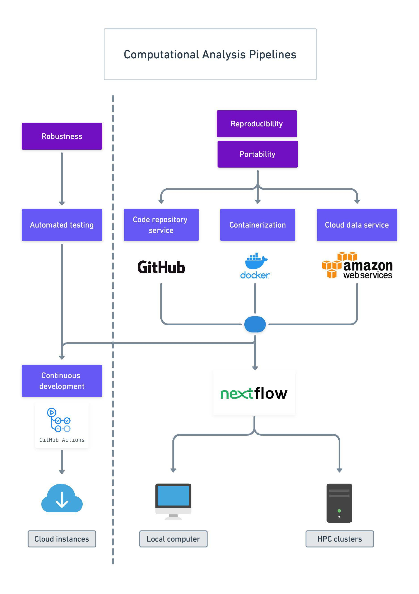

## The reproducibility crisis

To combat the growing crisis in reproducing scientific study results, Luslab has a set of standards for bioinformatic work which should be adhered to. This will maximise the reproducibility of your work whilst keeping software quality consistant within the lab.

More resources on the reproducibility crisis can be found here:

- [Nature 2016](https://www.nature.com/news/1-500-scientists-lift-the-lid-on-reproducibility-1.19970)
- [Wiki](https://en.wikipedia.org/wiki/Replication_crisis)
- [Nextflow presentation](https://www.youtube.com/watch?v=jsxTC8pNPUc&feature=emb_logo)

## Luslab data analysis and software

The diagram above shows the three tennets of reproducibility for data pipelines and software in luslab: Reproducibility, Portability and Robustness. Lab members should have this structure in their mind when designing both data analysis pipelines and software to ensure maximum quality and chance of someone else replicating your work.

### Reproducibility and Portability

To maximise the chance of someone else being able to replicate your bioinformatic work, it should be both easily obtainable, reproducible and portable to any machine.
